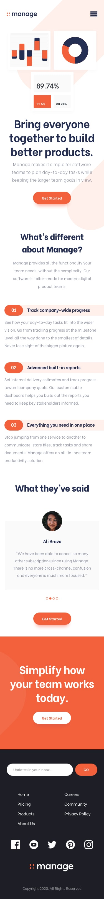

# Frontend Mentor - manage-landing-page

frontend mentor manage landing page challenge

This is my solution to the [Manage landing page Challenge on Frontend Mentor].

- Note:there are so many ways to complete this challenge, so this is my own way of completing the challenge.

# Challenge

Users should be able to:

- View the optimal layout for the site depending on their device's screen size
- See hover states for all interactive elements on the page
- See all testimonials in a horizontal slider
- Receive an error message when the newsletter sign up `form` is submitted if:
  - The `input` field is empty
  - The email address is not formatted correctly

# Screenshot

# Links

- My Solution URL:https://github.com/PRAISE-C24/manage-landing-page

- Live Site URL: https://praise-c24.github.io/manage-landing-page
  /

# Built with

- Semantic HTML5 markup
- tailwind css
- JavaScript
- Mobile-first workflow

# What I learned

I learned how to create an image slider.

I learned a lot on how tailwind css worked and how to use it.

# Useful resources

- Tailwind css :https://tailwindcss.com/ - the Tailwind css doc helped me understand how it works and how to use.

## Author

- Name - PRAISE CHIBUZOR
- Twitter - @PRAISE_C24
- Frontend Mentor - @PRAISE-C24 (https://www.frontendmentor.io/profile/PRAISE-C24)
